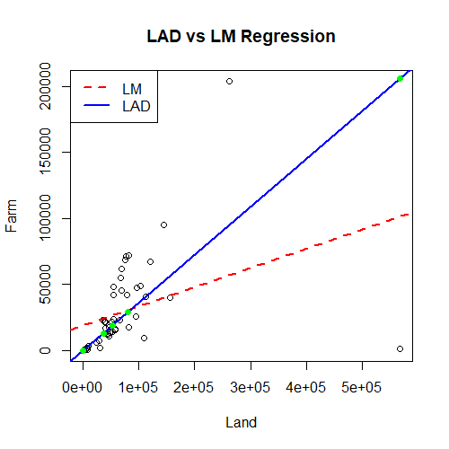

# robust: Least Absolute Deviations Regression

An R package that implements robust regression using **Least Absolute Deviations (LAD)**. It serves as a robust alternative to standard Ordinary Least Squares (OLS) methods, particularly effective for datasets containing outliers.

## Features

- Implements **SAD (Sum of Absolute Deviations)** minimization using the Nelder-Mead algorithm.
- Provides S3 methods for `print`, `coef`, and `predict` to integrate seamlessly with base R workflows.
- Custom plotting functionality to visualize robust fit vs. OLS fit.

## Installation

You can install the development version from GitHub:

```r
# install.packages("devtools")
devtools::install_github("chen-yaqin/robust")
````

## Example Usage

Here is a simple example showing how to fit a LAD regression model using the included `area` dataset and compare it with a standard linear model.

```r
library(robust)

# 1. Load the included dataset
data(area)

# 2. Fit the Robust LAD model
lad_model <- lad(x = area$land, y = area$farm)

# 3. Print the coefficients
print(lad_model)
# Output:
# (Intercept)           x 
#    5.867954    5.989218 

# 4. Make predictions
new_land_areas <- c(10, 20, 30)
predictions <- predict(lad_model, new.x = new_land_areas)
print(predictions)
```

## Visualization: LAD vs. OLS

One of the key advantages of this package is visualizing how LAD is less sensitive to outliers compared to Ordinary Least Squares (OLS).

You can reproduce the comparison plot using the following code:

```r
# Fit standard OLS for comparison
lm_model <- lm(farm ~ land, data = area)

# Plot data
plot(area$land, area$farm, 
     main = "Robust (LAD) vs. OLS Regression", 
     xlab = "Land Area", ylab = "Farm Area", 
     pch = 19, col = "gray")

# Add OLS line (Red, Dashed)
abline(lm_model, col = "red", lty = 2, lwd = 2)

# Add LAD line (Blue, Solid)
abline(lad_model, col = "blue", lwd = 2)

# Add Legend
legend("topleft", 
       legend = c("OLS (Mean-based)", "LAD (Median-based)"), 
       col = c("red", "blue"), 
       lty = c(2, 1), 
       lwd = 2)
```

*(Note: The LAD line (blue) ignores extreme outliers better than the OLS line (red).)*

## Methodology

This package solves the optimization problem by minimizing the **Sum of Absolute Deviations (SAD)**:

$$ \hat{\beta}_{LAD} = \text{argmin}_{\beta} \sum_{i=1}^{n} |y_i - (\beta_0 + \beta_1 x_i)| $$

Unlike OLS, which minimizes squared residuals ($\sum e_i^2$) and gives heavy weight to outliers, LAD minimizes absolute residuals ($\sum |e_i|$). The optimization is performed using the **Nelder-Mead** algorithm via R's `optim()` function.

## Dataset

The package includes the `area` dataset:

  - **Source**: Farm land area data.
  - **Usage**: `data(area)`

## Author

**Yaqin Chen** Department of Statistics, University of Wisconsin-Madison  
Email: [chenyq077@gmail.com](mailto:chenyq077@gmail.com)  
GitHub: [@chen-yaqin](https://github.com/chen-yaqin)
